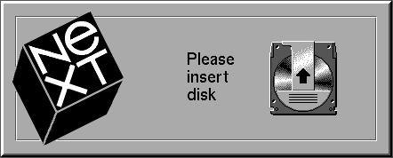

#NeXT Site
Inspired by Eric Levenez' NeXT site

Simple HTML/CSS site mimicing some key NeXT Workspace elements:

- Dock
- Default menu

#"Features"

- Splash page hides a link in the arrow of the MO disk at the uppermost position - configurable with imagemap

- Dock tiles require double-click

- Menu is draggable

- Resizable window keeps elements anchored

- Prefs.app Clock stopped in memorium of s.jobs departure

- Placebo Recycler

- Miniwindow application icon

----

----

#Working with it

# Index
The index.htm file presents the basic elements; Dock, Menu, App, Recycler.

## Dock

Dock is anchored to the top right. Each additional tile will be positioned within the div automatically. Create an icon using the NeXT-Icons.xcf file in The GIMP (below).

## Menu
The menu is composed of several elements wrapped in a 'ghost pane' that allows the menu to be moved about the screen.

The 'pad' contains the menu title, and each 'item' corresponds to menu list item.

## Recycler

Placebo. There's no dnd enabled and no real reason to do so.

## App window

App windows are anchored to the bottom left in a div similar to the dock. Tiles are positioned automatically.

## Icons
There is a GIMP file - NeXT-Icons.xcf with many icons converted directly from the TIFFs of an OpenStep 4.2 system.

These icons are Preferences dock icons, Workspace Manager icons as shown in the Shelf, as well as some dock applications.

There are two additional layers; Dock app tile and mini-window icon. When creating a minimized window icon, it's necessary to move the icon image down several pixels and write in the title in a small (8pt) font. Duplicating the file makes sense for this.

## Splash screen (optional)

Modify the image map to point to the local URL of your nextsite directory. It uses the uppermost arror position on the magneto-optical disk.
The image is Base64 encoded within the HTML.

NeXTInsertDisk.gif is the image used.

